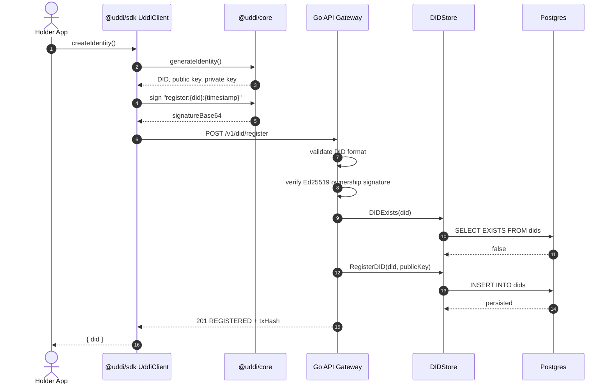
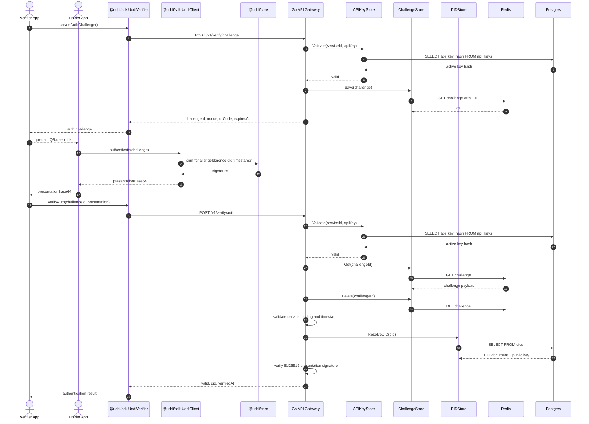
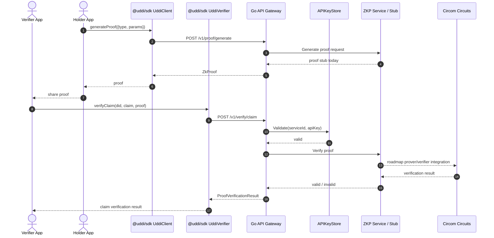

# UDDI - Universal Decentralized Digital Identity

UDDI is an alpha-stage framework for building decentralized digital identity systems. It combines DID-style identifiers, Ed25519 signatures, Verifiable Credential primitives, a TypeScript SDK, a Go API gateway, and early zero-knowledge proof circuits.

The repository is currently a framework foundation, not a production network. The implemented pieces are usable for local development and contract testing; blockchain persistence, production ZKP proving, mobile wallet flows, and mainnet/testnet operations are still roadmap items.

## Current Status

Implemented today:

- TypeScript monorepo using pnpm workspaces.
- `@uddi/core` identity generation, DID derivation, message signing, DID documents, and Verifiable Credential signing/verification.
- `@uddi/sdk` client/verifier SDK surface for identity creation, auth challenges, proof requests, DID resolution, and claim verification calls.
- Go API gateway with testable router, DID register/resolve/revoke endpoints, API key middleware, auth challenge generation, Ed25519 auth presentation verification, replay protection, and timestamp/service binding checks.
- DID storage abstraction in the API, with memory and Postgres-backed implementations.
- Credential registry abstraction in the API, with memory and Postgres-backed implementations.
- Challenge storage abstraction in the API, with memory and Redis-backed implementations.
- API key validation with memory and Postgres-backed stores, including seeded development credentials.
- Circom circuit drafts for age and citizenship verification.
- CI workflow for TypeScript and Go checks, with Rust/Docker jobs gated until those packages exist.

Not implemented yet:

- Substrate/Rust blockchain node and pallets.
- Full API-side Verifiable Credential cryptographic validation and compliance testing.
- Production API key management.
- Real ZKP prover/verifier service runtime.
- Mobile identity wallet.
- W3C DID/VC full compliance test suite.
- Public testnet/mainnet.

## Packages

| Package | Status | Description |
| --- | --- | --- |
| [`@uddi/core`](./packages/core) | Implemented alpha | Core identity, DID, signing, and VC primitives. |
| [`@uddi/sdk`](./packages/sdk) | Implemented alpha | Developer SDK for holder and verifier flows. |
| [`packages/api`](./packages/api) | Implemented alpha | Go REST API gateway with DID registry storage and auth verification. |
| [`packages/zkp`](./packages/zkp) | Circuit drafts | Circom circuits for age and citizenship proofs. |
| `packages/blockchain` | Roadmap | Planned Substrate blockchain node and pallets. |
| `packages/mobile` | Roadmap | Planned mobile wallet application. |

## Local Development

Requirements:

- Node.js 22.13 or newer
- Corepack
- Go 1.25.x for the API package

Install dependencies:

```bash
corepack enable pnpm
pnpm install
```

Copy the example environment file when you want to run the API locally outside Docker:

```bash
cp .env.example .env
```

Run TypeScript checks:

```bash
pnpm -r build
pnpm -r test
pnpm -r lint
```

Run Go API checks:

```bash
cd packages/api
go test ./...
go vet ./...
```

If your local sandbox cannot write to the default Go cache, use a workspace-local cache:

```bash
cd packages/api
mkdir -p .cache/go-build .cache/go-mod
GOCACHE="$PWD/.cache/go-build" GOMODCACHE="$PWD/.cache/go-mod" go test ./...
GOCACHE="$PWD/.cache/go-build" GOMODCACHE="$PWD/.cache/go-mod" go vet ./...
```

Run the API with Docker:

```bash
docker build -t uddi-api ./packages/api
docker run --rm -p 8080:8080 uddi-api
```

Run the current local compose stack:

```bash
docker compose -f infra/docker/docker-compose.dev.yml up --build
```

With compose running, run the optional Postgres integration test:

```bash
pnpm api:test:postgres
```

Run the optional Redis integration test:

```bash
pnpm api:test:redis
```

If you previously ran an older compose file and see orphan containers or Postgres role errors:

```bash
docker compose -f infra/docker/docker-compose.dev.yml down -v --remove-orphans
docker compose -f infra/docker/docker-compose.dev.yml up --build
```

If Docker reports that `uddi-api`, `uddi-postgres`, or `uddi-redis` is already in use from an older compose file:

```bash
docker rm uddi-api uddi-postgres uddi-redis
```

Run the end-to-end authentication example:

```bash
pnpm build
pnpm example:auth-flow
```

## SDK Example

User/holder side:

```typescript
import { UddiClient } from '@uddi/sdk';

const client = new UddiClient({ network: 'local' });
const { did } = await client.createIdentity();

console.log(did);
```

Verifier side:

```typescript
import { UddiVerifier } from '@uddi/sdk';

const verifier = new UddiVerifier({
  network: 'local',
  serviceId: 'my-app',
  apiKey: process.env.UDDI_API_KEY!,
});

const challenge = await verifier.createAuthChallenge();
const result = await verifier.verifyAuth(challenge.challengeId, presentation);

if (result.valid) {
  console.log(`Authenticated DID: ${result.did}`);
}
```

## API Overview

Detailed request and response examples live in [`docs/API.md`](./docs/API.md).

Current REST surface:

- `GET /health`
- `POST /v1/did/register`
- `GET /v1/did/{did}`
- `POST /v1/did/revoke`
- `PUT /v1/did/{did}/update` - placeholder
- `GET /v1/credentials/{did}` - API key required
- `POST /v1/credentials/issue` - API key required
- `POST /v1/credentials/revoke` - API key required
- `GET /v1/credentials/{id}/verify` - API key required
- `POST /v1/verify/challenge` - API key required
- `POST /v1/verify/auth` - API key required
- `POST /v1/verify/claim` - API key required, ZKP stub
- `POST /v1/proof/generate` - ZKP stub
- `GET /v1/registry/stats`

When `UDDI_DATABASE_URL` is configured, the API persists DID registry and API key data in Postgres. Without it, the API falls back to in-memory stores for lightweight tests and local experimentation.

## Architecture

```text
+------------------------------------------------------------------+
|                          Applications                            |
|        web apps, verifier services, wallets, backend systems      |
+-------------------------------+----------------------------------+
                                |
                                | @uddi/sdk
                                | - UddiClient: holder/user flows
                                | - UddiVerifier: verifier/app flows
                                v
+------------------------------------------------------------------+
|                         Go API Gateway                           |
|                                                                  |
|  Public routes                                                   |
|  - health                                                        |
|  - DID register / resolve / revoke                               |
|  - proof generation stub                                         |
|                                                                  |
|  Protected routes                                                |
|  - credential endpoints                                          |
|  - auth challenge / auth verification                            |
|  - claim verification stub                                       |
|                                                                  |
|  Security checks                                                 |
|  - API key + service ID validation                               |
|  - Ed25519 auth presentation verification                        |
|  - challenge replay protection                                   |
|  - service binding and timestamp windows                         |
+---------------+-----------------------+--------------------------+
                |                       |
                |                       |
                v                       v
+----------------------------+  +----------------------------------+
|          Postgres          |  |              Redis               |
|                            |  |                                  |
|  DIDStore                  |  |  ChallengeStore                  |
|  - dids                    |  |  - short-lived auth challenges   |
|                            |  |  - single-use verification state |
|  APIKeyStore               |  |  - TTL based on challenge expiry |
|  - api_keys                |  |                                  |
+----------------------------+  +----------------------------------+
                |
                | future registry adapter
                v
+------------------------------------------------------------------+
|                  Blockchain Registry (Roadmap)                   |
|        planned Substrate node / DID registry / revocation         |
+------------------------------------------------------------------+

+------------------------------------------------------------------+
|                         @uddi/core                               |
| identity generation, DID derivation, signing, DID documents,      |
| Verifiable Credential issue/verify/hash/presentation primitives   |
+------------------------------------------------------------------+

+------------------------------------------------------------------+
|                         ZKP Layer                                |
| Circom circuit drafts exist today for age and citizenship claims. |
| Runtime prover/verifier service integration is still roadmap.     |
+------------------------------------------------------------------+
```

### Data Flow

```text
1. Holder creates identity
   @uddi/sdk -> @uddi/core
   - generate Ed25519 keypair
   - derive did:uddi:z...
   - private key stays with holder

2. Holder registers DID
   UddiClient -> API /v1/did/register -> DIDStore
   - API verifies ownership signature
   - DID document metadata is stored in Postgres when configured

3. Verifier creates auth challenge
   UddiVerifier -> API /v1/verify/challenge -> APIKeyStore + ChallengeStore
   - API validates service ID + API key
   - challenge is stored in Redis with TTL

4. Holder authenticates
   UddiClient -> @uddi/core signing
   - signs challengeId:nonce:did:timestamp

5. Verifier checks authentication
   UddiVerifier -> API /v1/verify/auth
   - API consumes challenge once
   - validates service binding and timestamp window
   - resolves DID public key
   - verifies Ed25519 signature
```

### Storage Modes

| Concern | Default/Test Mode | Compose Dev Mode |
| --- | --- | --- |
| DID registry | Memory store | Postgres `dids` table |
| API keys | Memory seeded keys | Postgres `api_keys` table |
| Auth challenges | Memory store | Redis with TTL |
| Credential registry | Memory store | Postgres `credentials` table |
| ZKP verification | Stub/circuit drafts | Roadmap service |

## Sequence Diagrams

### DID Registration



### Authentication Challenge And Verification



### Claim Verification With ZKP Stub



## Roadmap

- Replace in-memory blockchain client with real registry integration.
- Add full API-side cryptographic VC verification and DID/VC compliance coverage.
- Build ZKP prover/verifier service around the existing circuits.
- Add compliance tests for DID and Verifiable Credentials.
- Add mobile wallet/holder application.
- Prepare testnet deployment.

## Contributing

Read [CONTRIBUTING.md](./CONTRIBUTING.md) before opening issues or pull requests. This project is still alpha, so small, well-tested improvements to the core, SDK, API contracts, and documentation are especially useful.

## License

UDDI is released under the [Apache 2.0 License](./LICENSE).
